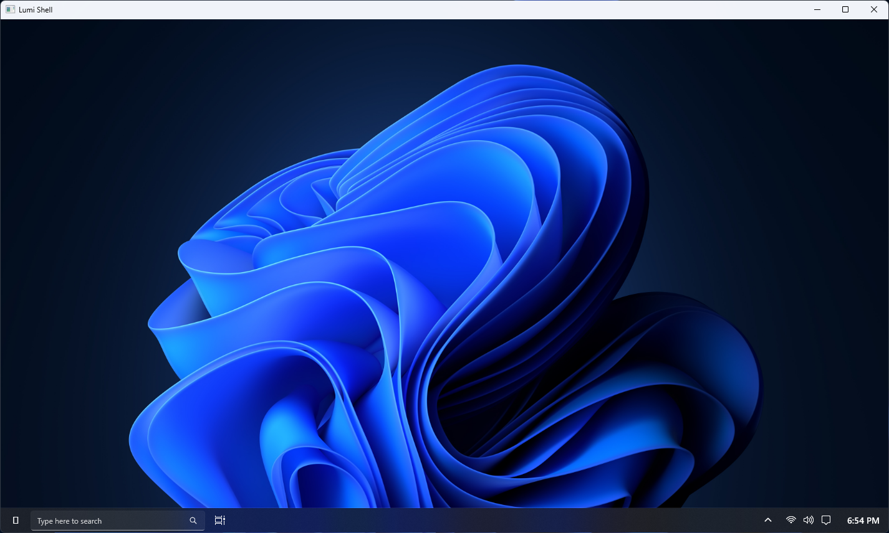

###### Windows-Development-Public/Archive
## CustomShellTesting

Lumi Shell test window. Can display the system wallpaper & time, but that's about it

You'll notice an invalid glyph being displayed on the start button - that *should've* been the Windows 10 logo, but it's missing from more recent versions of the Segoe Fluent Icons font

