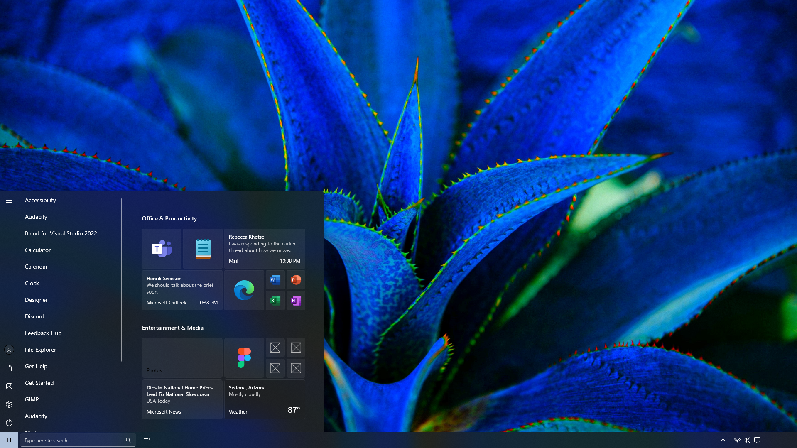
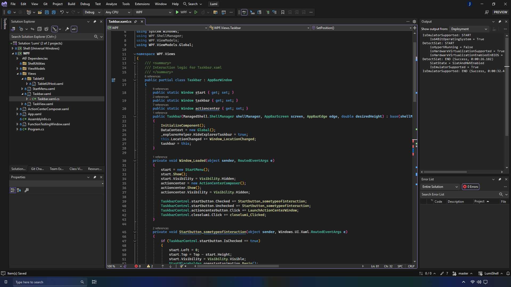

###### Windows-Development-Public/Archive
## LumiShell

An incomplete, XAML Islands (UWP & WPF) based shell replacement for Windows 10 and 11. I was going for a mostly XAML-Based shell, even wanted the wallpaper to be XAML-Based, never got to implementing that though

Earlier version [can be found here,](https://github.com/Jdaslepre/Windows-Development-Public/Archive/CustomShellTesting) and The design of the shell was similar to [the one shown in this video.](https://www.youtube.com/watch?v=RbnkwOfLFKM)

You'll notice an invalid glyph being displayed on the start button - that should've been the Windows 10 logo, but it's missing from more recent versions of the Segoe Fluent Icons font




#### Other projects used here:
```
https://github.com/ADeltaX/IWindowPrivate
https://github.com/cairoshell/ManagedShell
```